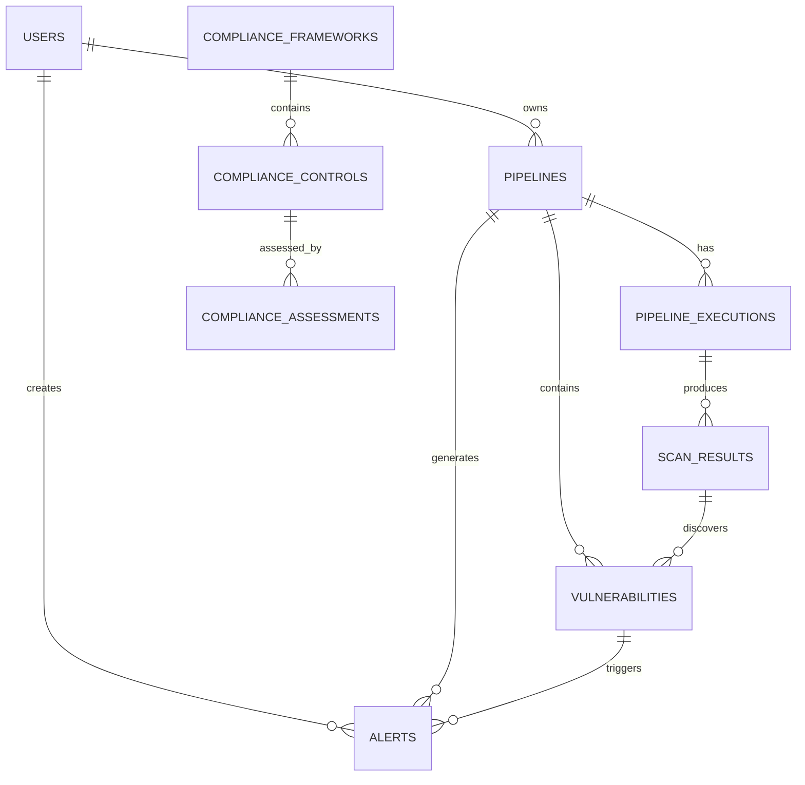

# SecureOps Architecture Documentation

## Table of Contents

1. [System Overview](#system-overview)
2. [Architecture Principles](#architecture-principles)
3. [High-Level Architecture](#high-level-architecture)
4. [Component Architecture](#component-architecture)
5. [Data Architecture](#data-architecture)
6. [Security Architecture](#security-architecture)
7. [Deployment Architecture](#deployment-architecture)
8. [Integration Architecture](#integration-architecture)
9. [Scalability and Performance](#scalability-and-performance)
10. [Monitoring and Observability](#monitoring-and-observability)
11. [Disaster Recovery](#disaster-recovery)

## System Overview

SecureOps is a comprehensive DevSecOps CI/CD Pipeline Monitor that provides real-time security monitoring, vulnerability management, and compliance automation for modern software development workflows. The platform integrates with popular CI/CD platforms and security tools to provide a unified view of security posture across the entire development lifecycle.

### Key Capabilities

- **Pipeline Monitoring**: Real-time monitoring of CI/CD pipelines across multiple platforms
- **Security Scanning**: Automated vulnerability detection using multiple security scanners
- **Compliance Management**: Automated compliance checking and reporting
- **Alert Management**: Intelligent alerting and notification system
- **Dashboard Analytics**: Comprehensive security metrics and reporting

### Technology Stack

- **Backend**: FastAPI (Python 3.9+), SQLAlchemy, Celery
- **Database**: PostgreSQL 13+, Redis
- **Frontend**: React 18, Material-UI, Chart.js
- **Infrastructure**: Docker, Kubernetes, Nginx
- **Monitoring**: Prometheus, Grafana
- **Security**: JWT authentication, RBAC, TLS encryption

## Architecture Principles

### 1. Microservices Architecture
- **Service Decomposition**: Clear separation of concerns with dedicated services
- **API-First Design**: RESTful APIs with OpenAPI specifications
- **Event-Driven Communication**: Asynchronous messaging between services

### 2. Cloud-Native Design
- **Container-First**: All components containerized for consistency
- **Orchestration Ready**: Kubernetes-native deployment patterns
- **12-Factor App**: Following cloud-native best practices

### 3. Security by Design
- **Zero Trust**: No implicit trust between components
- **Defense in Depth**: Multiple layers of security controls
- **Principle of Least Privilege**: Minimal required permissions

### 4. Scalability and Performance
- **Horizontal Scaling**: Stateless design for easy scaling
- **Caching Strategy**: Multi-level caching for performance
- **Asynchronous Processing**: Background tasks for heavy operations

### 5. Observability
- **Comprehensive Logging**: Structured logging across all components
- **Metrics Collection**: Real-time performance and business metrics
- **Distributed Tracing**: End-to-end request tracing

## High-Level Architecture

```
┌─────────────────────────────────────────────────────────────────────────────┐
│                              External Services                               │
├─────────────────────────────────────────────────────────────────────────────┤
│  GitHub Actions │ GitLab CI │ Jenkins │ Azure DevOps │ Security Scanners    │
└─────────────────┬───────────┬─────────┬─────────────┬─────────────────────────┘
                  │           │         │             │
                  ▼           ▼         ▼             ▼
┌─────────────────────────────────────────────────────────────────────────────┐
│                           API Gateway / Load Balancer                       │
│                                  (Nginx)                                    │
└─────────────────────────────────┬───────────────────────────────────────────┘
                                  │
                                  ▼
┌─────────────────────────────────────────────────────────────────────────────┐
│                              Frontend Layer                                 │
│                         React Application (SPA)                            │
└─────────────────────────────────┬───────────────────────────────────────────┘
                                  │
                                  ▼
┌─────────────────────────────────────────────────────────────────────────────┐
│                              API Layer                                      │
│                           FastAPI Backend                                   │
├─────────────────┬───────────────────┬───────────────────┬───────────────────┤
│   Auth Service  │  Pipeline Service │  Alert Service    │ Compliance Service│
└─────────────────┼───────────────────┼───────────────────┼───────────────────┘
                  │                   │                   │
                  ▼                   ▼                   ▼
┌─────────────────────────────────────────────────────────────────────────────┐
│                           Business Logic Layer                              │
├─────────────────┬───────────────────┬───────────────────┬───────────────────┤
│ User Management │  Pipeline Manager │  Vulnerability    │  Compliance       │
│                 │                   │  Manager          │  Manager          │
├─────────────────┼───────────────────┼───────────────────┼───────────────────┤
│ Report Service  │  Alert Service    │  Notification     │  Scanning         │
│                 │                   │  Service          │  Service          │
└─────────────────┼───────────────────┼───────────────────┼───────────────────┘
                  │                   │                   │
                  ▼                   ▼                   ▼
┌─────────────────────────────────────────────────────────────────────────────┐
│                          Task Processing Layer                              │
│                           Celery Workers                                    │
├─────────────────┬───────────────────┬───────────────────┬───────────────────┤
│  Scan Workers   │  Report Workers   │  Alert Workers    │ Cleanup Workers   │
└─────────────────┼───────────────────┼───────────────────┼───────────────────┘
                  │                   │                   │
                  ▼                   ▼                   ▼
┌─────────────────────────────────────────────────────────────────────────────┐
│                             Data Layer                                      │
├─────────────────┬───────────────────┬───────────────────┬───────────────────┤
│   PostgreSQL    │      Redis        │   File Storage    │   Monitoring      │
│   (Primary DB)  │  (Cache/Queue)    │   (Reports/Logs)  │   (Prometheus)    │
└─────────────────┴───────────────────┴───────────────────┴───────────────────┘
```

## Component Architecture

### API Gateway / Load Balancer (Nginx)

**Purpose**: Entry point for all external traffic, handles SSL termination, load balancing, and basic security.

**Responsibilities**:
- SSL/TLS termination
- Request routing and load balancing
- Rate limiting and DDoS protection
- Static file serving
- Request/response caching

**Configuration**:
```nginx
upstream api_backend {
    server api-1:8000;
    server api-2:8000;
    server api-3:8000;
}

upstream frontend {
    server frontend-1:3000;
    server frontend-2:3000;
}
```

### Frontend Application (React)

**Purpose**: User interface for the SecureOps platform providing dashboards, configuration, and management capabilities.

**Architecture Pattern**: Single Page Application (SPA) with component-based architecture

**Key Components**:
- **Dashboard**: Overview of security metrics and alerts
- **Pipeline Management**: Configure and monitor CI/CD pipelines
- **Alert Management**: View and manage security alerts
- **Compliance Dashboard**: Compliance framework status and reports
- **Settings**: System configuration and user preferences

**State Management**:
- **React Context**: Authentication and user state
- **Local State**: Component-specific state
- **Real-time Updates**: WebSocket integration for live data

**Technology Stack**:
```json
{
  "framework": "React 18.2.0",
  "ui_library": "Material-UI 5.11.0",
  "charts": "Chart.js 4.2.0",
  "animations": "Framer Motion 8.5.0",
  "http_client": "Axios 1.2.0",
  "websocket": "Native WebSocket API",
  "build_tool": "Vite 4.0.0"
}
```

### API Layer (FastAPI)

**Purpose**: Core backend services providing RESTful APIs and business logic orchestration.

**Architecture Pattern**: Service-oriented architecture with clear separation of concerns

**Core Services**:

#### Authentication Service
- JWT token management
- User registration and login
- Password reset and email verification
- Role-based access control (RBAC)
- Session management

#### Pipeline Service
- CI/CD platform integration
- Pipeline configuration management
- Webhook handling
- Pipeline execution monitoring
- Statistics and reporting

#### Alert Service
- Alert creation and management
- Severity classification
- Alert aggregation and deduplication
- Notification orchestration
- Alert lifecycle management

#### Compliance Service
- Compliance framework management
- Control assessment automation
- Compliance reporting
- Policy enforcement
- Audit trail management

**API Design**:
```python
# Example service structure
class PipelineService:
    def __init__(self, db: Database, cache: Cache):
        self.db = db
        self.cache = cache
    
    async def create_pipeline(self, pipeline_data: PipelineCreate) -> Pipeline:
        # Business logic for pipeline creation
        pass
    
    async def trigger_pipeline(self, pipeline_id: int) -> PipelineExecution:
        # Trigger pipeline execution
        pass
```

### Business Logic Layer

**Purpose**: Core business logic implementation and data processing orchestration.

#### User Management
- User profile management
- Permission and role assignment
- User activity tracking
- Preference management

#### Pipeline Manager
- Pipeline lifecycle management
- Integration with CI/CD platforms
- Pipeline health monitoring
- Performance analytics

#### Vulnerability Manager
- Vulnerability data processing
- Risk assessment and prioritization
- Vulnerability lifecycle tracking
- Remediation recommendations

#### Compliance Manager
- Compliance framework implementation
- Control assessment logic
- Compliance reporting
- Policy automation

### Task Processing Layer (Celery)

**Purpose**: Asynchronous task processing for heavy operations and background jobs.

**Architecture Pattern**: Distributed task queue with worker specialization

**Worker Types**:

#### Scan Workers
- Security scan execution
- Scanner integration
- Result processing and storage
- Scan scheduling

#### Report Workers
- Report generation
- Data aggregation and analysis
- Export functionality
- Notification delivery

#### Alert Workers
- Alert processing and enrichment
- Notification delivery
- Alert aggregation
- Escalation handling

#### Cleanup Workers
- Data retention enforcement
- Log rotation
- Cache cleanup
- Orphaned resource cleanup

**Configuration**:
```python
# Celery configuration
CELERY_CONFIG = {
    'broker_url': 'redis://redis:6379/0',
    'result_backend': 'redis://redis:6379/0',
    'task_serializer': 'json',
    'accept_content': ['json'],
    'timezone': 'UTC',
    'worker_prefetch_multiplier': 1,
    'task_acks_late': True,
}
```

### Data Layer

**Purpose**: Data persistence, caching, and storage management.

#### PostgreSQL (Primary Database)
- Relational data storage
- ACID compliance
- Advanced querying capabilities
- Full-text search

**Schema Design**:
```sql
-- Core tables
CREATE TABLE users (
    id SERIAL PRIMARY KEY,
    email VARCHAR(255) UNIQUE NOT NULL,
    password_hash VARCHAR(255) NOT NULL,
    created_at TIMESTAMP DEFAULT NOW()
);

CREATE TABLE pipelines (
    id SERIAL PRIMARY KEY,
    name VARCHAR(255) NOT NULL,
    platform VARCHAR(50) NOT NULL,
    repository_url VARCHAR(500),
    created_at TIMESTAMP DEFAULT NOW()
);

CREATE TABLE alerts (
    id SERIAL PRIMARY KEY,
    title VARCHAR(255) NOT NULL,
    severity VARCHAR(20) NOT NULL,
    status VARCHAR(20) DEFAULT 'open',
    pipeline_id INTEGER REFERENCES pipelines(id),
    created_at TIMESTAMP DEFAULT NOW()
);
```

#### Redis (Cache and Message Broker)
- Session storage
- API response caching
- Task queue management
- Real-time data caching

**Usage Patterns**:
```python
# Caching example
@cached(ttl=300)
async def get_pipeline_stats(pipeline_id: int) -> PipelineStats:
    return await calculate_pipeline_stats(pipeline_id)
```

#### File Storage
- Report storage (PDF, CSV, JSON)
- Log file management
- Scan result artifacts
- Configuration backups

## Data Architecture

### Data Model

#### Core Entities



#### Data Flow

1. **Ingestion**: Data flows in from CI/CD platforms via webhooks
2. **Processing**: Background workers process and enrich data
3. **Storage**: Processed data stored in PostgreSQL with Redis caching
4. **Analytics**: Real-time analytics computed and cached
5. **Presentation**: Data served via API to frontend applications

### Data Retention

- **Audit Logs**: 7 years retention
- **Pipeline Executions**: 1 year retention
- **Scan Results**: 2 years retention
- **Alerts**: 3 years retention
- **User Activity**: 2 years retention

### Data Backup Strategy

- **Daily Backups**: Automated PostgreSQL backups
- **Point-in-Time Recovery**: WAL archiving enabled
- **Cross-Region Replication**: Secondary read replicas
- **Configuration Backup**: Infrastructure as Code snapshots

## Security Architecture

### Authentication and Authorization

#### Multi-Factor Authentication
- TOTP support via authenticator apps
- SMS backup codes
- Email verification for sensitive operations

#### Role-Based Access Control (RBAC)
```python
# Permission model
PERMISSIONS = {
    'admin': ['*'],
    'security_analyst': [
        'read:pipelines', 'read:alerts', 'write:alerts',
        'read:vulnerabilities', 'read:compliance'
    ],
    'developer': [
        'read:pipelines', 'write:pipelines',
        'read:alerts', 'read:scan_results'
    ],
    'viewer': [
        'read:dashboards', 'read:reports'
    ]
}
```

### Network Security

#### Security Zones
- **DMZ**: Load balancer and reverse proxy
- **Application Zone**: API and frontend services
- **Data Zone**: Database and cache services
- **Management Zone**: Monitoring and administration tools

#### Network Policies
```yaml
# Kubernetes network policy example
apiVersion: networking.k8s.io/v1
kind: NetworkPolicy
metadata:
  name: api-network-policy
spec:
  podSelector:
    matchLabels:
      app: api
  policyTypes:
  - Ingress
  - Egress
  ingress:
  - from:
    - namespaceSelector:
        matchLabels:
          name: frontend
    ports:
    - protocol: TCP
      port: 8000
```

### Data Security

#### Encryption
- **At Rest**: AES-256 encryption for sensitive data
- **In Transit**: TLS 1.3 for all communications
- **Database**: Transparent Data Encryption (TDE)
- **Secrets**: Kubernetes secrets with encryption at rest

#### Data Classification
- **Public**: Documentation, marketing materials
- **Internal**: System configurations, logs
- **Confidential**: User data, scan results
- **Restricted**: Authentication tokens, encryption keys

### Application Security

#### Security Headers
```nginx
# Security headers configuration
add_header X-Frame-Options "SAMEORIGIN" always;
add_header X-XSS-Protection "1; mode=block" always;
add_header X-Content-Type-Options "nosniff" always;
add_header Referrer-Policy "strict-origin-when-cross-origin" always;
add_header Content-Security-Policy "default-src 'self'" always;
```

#### Input Validation
- **API Validation**: Pydantic models for request validation
- **SQL Injection Prevention**: Parameterized queries
- **XSS Prevention**: Output encoding and CSP headers
- **CSRF Protection**: SameSite cookies and CSRF tokens

### Secrets Management

#### Kubernetes Secrets
```yaml
apiVersion: v1
kind: Secret
metadata:
  name: app-secrets
type: Opaque
data:
  database-url: <base64-encoded-url>
  redis-url: <base64-encoded-url>
  jwt-secret: <base64-encoded-secret>
```

#### External Secrets Operator
Integration with external secret management systems:
- HashiCorp Vault
- AWS Secrets Manager
- Azure Key Vault
- Google Secret Manager

## Deployment Architecture

### Container Architecture

#### Multi-Stage Docker Builds
```dockerfile
# Example Dockerfile for API service
FROM python:3.9-slim as builder
WORKDIR /app
COPY requirements.txt .
RUN pip install --user -r requirements.txt

FROM python:3.9-slim as runtime
COPY --from=builder /root/.local /root/.local
WORKDIR /app
COPY . .
EXPOSE 8000
CMD ["uvicorn", "main:app", "--host", "0.0.0.0", "--port", "8000"]
```

#### Container Optimization
- **Distroless Images**: Minimal runtime images
- **Layer Caching**: Optimized layer ordering
- **Security Scanning**: Container vulnerability scanning
- **Resource Limits**: Memory and CPU constraints

### Kubernetes Deployment

#### Namespace Organization
```yaml
# Namespace structure
apiVersion: v1
kind: Namespace
metadata:
  name: secureops-production
  labels:
    name: secureops-production
    tier: production
```

#### Deployment Strategy
```yaml
apiVersion: apps/v1
kind: Deployment
metadata:
  name: api-deployment
spec:
  replicas: 3
  strategy:
    type: RollingUpdate
    rollingUpdate:
      maxSurge: 1
      maxUnavailable: 0
  selector:
    matchLabels:
      app: api
  template:
    metadata:
      labels:
        app: api
    spec:
      containers:
      - name: api
        image: secureops/api:latest
        ports:
        - containerPort: 8000
        resources:
          requests:
            memory: "256Mi"
            cpu: "250m"
          limits:
            memory: "512Mi"
            cpu: "500m"
        livenessProbe:
          httpGet:
            path: /health
            port: 8000
          initialDelaySeconds: 30
          periodSeconds: 10
        readinessProbe:
          httpGet:
            path: /ready
            port: 8000
          initialDelaySeconds: 5
          periodSeconds: 5
```

#### Service Mesh (Optional)
- **Istio Integration**: Traffic management and security
- **mTLS**: Automatic mutual TLS between services
- **Circuit Breaking**: Fault tolerance patterns
- **Observability**: Distributed tracing and metrics

### Environment Management

#### Configuration Management
```yaml
# ConfigMap for application configuration
apiVersion: v1
kind: ConfigMap
metadata:
  name: app-config
data:
  database_pool_size: "20"
  cache_ttl: "3600"
  log_level: "INFO"
  cors_origins: "https://app.secureops.com"
```

#### Environment Promotion
1. **Development**: Feature development and testing
2. **Staging**: Integration testing and QA
3. **Production**: Live environment with monitoring

## Integration Architecture

### CI/CD Platform Integrations

#### GitHub Actions
```python
# GitHub webhook handler
@router.post("/webhook/github")
async def github_webhook(
    request: Request,
    signature: str = Header(None, alias="X-Hub-Signature-256")
):
    payload = await request.body()
    
    # Verify webhook signature
    if not verify_github_signature(payload, signature):
        raise HTTPException(401, "Invalid signature")
    
    event_data = json.loads(payload)
    
    # Process webhook event
    await process_github_event(event_data)
    
    return {"status": "processed"}
```

#### GitLab CI Integration
```python
# GitLab webhook configuration
GITLAB_WEBHOOK_CONFIG = {
    "url": "https://api.secureops.com/webhook/gitlab",
    "push_events": True,
    "issues_events": False,
    "merge_requests_events": True,
    "tag_push_events": True,
    "pipeline_events": True,
    "build_events": True
}
```

### Security Scanner Integrations

#### Scanner Architecture
```python
# Scanner interface
class SecurityScanner:
    async def scan(self, target: ScanTarget) -> ScanResult:
        raise NotImplementedError
    
    async def parse_results(self, raw_output: str) -> List[Vulnerability]:
        raise NotImplementedError

# Trivy scanner implementation
class TrivyScanner(SecurityScanner):
    async def scan(self, target: ScanTarget) -> ScanResult:
        cmd = [
            "trivy",
            "image",
            "--format", "json",
            "--no-progress",
            target.image
        ]
        
        result = await run_command(cmd)
        vulnerabilities = await self.parse_results(result.stdout)
        
        return ScanResult(
            scanner="trivy",
            target=target,
            vulnerabilities=vulnerabilities
        )
```

### External API Integrations

#### Rate Limiting and Circuit Breaking
```python
# Rate limiting for external APIs
@rate_limit("github_api", max_calls=5000, window=3600)
async def call_github_api(url: str, token: str) -> dict:
    headers = {"Authorization": f"token {token}"}
    
    async with aiohttp.ClientSession() as session:
        async with session.get(url, headers=headers) as response:
            return await response.json()

# Circuit breaker pattern
@circuit_breaker(failure_threshold=5, timeout=60)
async def call_external_service(service_url: str) -> dict:
    # External service call implementation
    pass
```

## Scalability and Performance

### Horizontal Scaling

#### Auto-scaling Configuration
```yaml
apiVersion: autoscaling/v2
kind: HorizontalPodAutoscaler
metadata:
  name: api-hpa
spec:
  scaleTargetRef:
    apiVersion: apps/v1
    kind: Deployment
    name: api-deployment
  minReplicas: 3
  maxReplicas: 10
  metrics:
  - type: Resource
    resource:
      name: cpu
      target:
        type: Utilization
        averageUtilization: 70
  - type: Resource
    resource:
      name: memory
      target:
        type: Utilization
        averageUtilization: 80
```

#### Database Scaling
- **Read Replicas**: PostgreSQL read replicas for read-heavy workloads
- **Connection Pooling**: PgBouncer for connection management
- **Partitioning**: Table partitioning for large datasets
- **Indexing Strategy**: Optimized indexes for query performance

### Caching Strategy

#### Multi-Level Caching
```python
# Application-level caching
class CacheManager:
    def __init__(self):
        self.l1_cache = {}  # In-memory cache
        self.l2_cache = redis_client  # Redis cache
        self.l3_cache = database  # Database cache
    
    async def get(self, key: str) -> Any:
        # Try L1 cache first
        if key in self.l1_cache:
            return self.l1_cache[key]
        
        # Try L2 cache
        value = await self.l2_cache.get(key)
        if value:
            self.l1_cache[key] = value
            return value
        
        # Fallback to L3 cache/database
        value = await self.l3_cache.get(key)
        if value:
            await self.l2_cache.set(key, value, ttl=3600)
            self.l1_cache[key] = value
        
        return value
```

### Performance Optimization

#### Database Optimization
```sql
-- Index optimization examples
CREATE INDEX CONCURRENTLY idx_alerts_pipeline_severity 
ON alerts(pipeline_id, severity, created_at);

CREATE INDEX CONCURRENTLY idx_vulnerabilities_cve_status 
ON vulnerabilities(cve_id, status) WHERE status = 'open';

-- Partitioning example
CREATE TABLE scan_results_2023_01 PARTITION OF scan_results
FOR VALUES FROM ('2023-01-01') TO ('2023-02-01');
```

#### Query Optimization
```python
# Optimized query with proper joins and filtering
async def get_pipeline_alerts(
    pipeline_id: int,
    severity_filter: List[str] = None,
    limit: int = 20,
    offset: int = 0
) -> List[Alert]:
    query = select(Alert).where(Alert.pipeline_id == pipeline_id)
    
    if severity_filter:
        query = query.where(Alert.severity.in_(severity_filter))
    
    query = query.options(
        joinedload(Alert.vulnerability),
        joinedload(Alert.pipeline)
    ).limit(limit).offset(offset)
    
    result = await db.execute(query)
    return result.scalars().all()
```

## Monitoring and Observability

### Metrics Collection

#### Application Metrics
```python
# Prometheus metrics
from prometheus_client import Counter, Histogram, Gauge

# Custom metrics
REQUEST_COUNT = Counter(
    'http_requests_total',
    'Total HTTP requests',
    ['method', 'endpoint', 'status']
)

REQUEST_DURATION = Histogram(
    'http_request_duration_seconds',
    'HTTP request duration',
    ['method', 'endpoint']
)

ACTIVE_PIPELINES = Gauge(
    'active_pipelines_total',
    'Number of active pipelines'
)
```

#### Infrastructure Metrics
- **CPU and Memory Usage**: Container resource utilization
- **Network Traffic**: Ingress and egress traffic metrics
- **Storage I/O**: Database and file system performance
- **Application Performance**: Response times and error rates

### Logging Strategy

#### Structured Logging
```python
import structlog

logger = structlog.get_logger()

# Example log entry
logger.info(
    "Pipeline execution completed",
    pipeline_id=123,
    execution_id="exec_456",
    duration=245.7,
    status="success",
    vulnerabilities_found=3
)
```

#### Log Aggregation
- **Collection**: Fluentd or Fluent Bit for log collection
- **Storage**: Elasticsearch for log storage and indexing
- **Visualization**: Kibana for log analysis and dashboards
- **Alerting**: ElastAlert for log-based alerting

### Distributed Tracing

#### OpenTelemetry Integration
```python
from opentelemetry import trace
from opentelemetry.exporter.jaeger.thrift import JaegerExporter
from opentelemetry.sdk.trace import TracerProvider
from opentelemetry.sdk.trace.export import BatchSpanProcessor

# Configure tracing
trace.set_tracer_provider(TracerProvider())
tracer = trace.get_tracer(__name__)

jaeger_exporter = JaegerExporter(
    agent_host_name="jaeger-agent",
    agent_port=6831,
)

span_processor = BatchSpanProcessor(jaeger_exporter)
trace.get_tracer_provider().add_span_processor(span_processor)

# Usage in application
@tracer.start_as_current_span("process_scan_results")
async def process_scan_results(scan_id: str):
    with tracer.start_as_current_span("parse_vulnerabilities"):
        vulnerabilities = await parse_scan_output(scan_id)
    
    with tracer.start_as_current_span("save_to_database"):
        await save_vulnerabilities(vulnerabilities)
```

### Health Checks and Alerts

#### Health Check Endpoints
```python
@router.get("/health")
async def health_check():
    checks = {
        "database": await check_database_connection(),
        "redis": await check_redis_connection(),
        "external_apis": await check_external_apis()
    }
    
    all_healthy = all(checks.values())
    status_code = 200 if all_healthy else 503
    
    return Response(
        content=json.dumps(checks),
        status_code=status_code,
        media_type="application/json"
    )
```

#### Alerting Rules
```yaml
# Prometheus alerting rules
groups:
- name: secureops_alerts
  rules:
  - alert: HighErrorRate
    expr: rate(http_requests_total{status=~"5.."}[5m]) > 0.1
    for: 5m
    labels:
      severity: critical
    annotations:
      summary: High error rate detected
      description: "Error rate is {{ $value }} requests per second"
  
  - alert: DatabaseConnectionsHigh
    expr: postgres_connections_active / postgres_connections_max > 0.8
    for: 2m
    labels:
      severity: warning
    annotations:
      summary: Database connection pool nearly exhausted
```

## Disaster Recovery

### Backup Strategy

#### Database Backups
```bash
#!/bin/bash
# Automated backup script
BACKUP_DIR="/backups/$(date +%Y-%m-%d)"
mkdir -p "$BACKUP_DIR"

# Create database backup
pg_dump -h postgres -U postgres secureops > "$BACKUP_DIR/database.sql"

# Compress and encrypt
gzip "$BACKUP_DIR/database.sql"
gpg --encrypt --recipient backup@secureops.com "$BACKUP_DIR/database.sql.gz"

# Upload to cloud storage
aws s3 cp "$BACKUP_DIR/database.sql.gz.gpg" s3://secureops-backups/
```

#### Configuration Backups
- **Kubernetes Manifests**: Version-controlled infrastructure as code
- **Terraform State**: Remote state storage with versioning
- **Application Configuration**: ConfigMaps and Secrets backup
- **Certificate Backup**: TLS certificates and private keys

### Recovery Procedures

#### Database Recovery
1. **Point-in-Time Recovery**: Using WAL files for precise recovery
2. **Backup Restoration**: Full database restoration from backups
3. **Data Validation**: Integrity checks after recovery
4. **Application Testing**: Functionality verification

#### Service Recovery
1. **Container Restart**: Automatic container health checks and restarts
2. **Pod Replacement**: Kubernetes pod replacement on failure
3. **Node Recovery**: Cluster node replacement procedures
4. **Data Center Failover**: Multi-region failover procedures

### Business Continuity

#### Recovery Time Objectives (RTO)
- **Critical Services**: 15 minutes
- **Standard Services**: 1 hour
- **Non-Critical Services**: 4 hours

#### Recovery Point Objectives (RPO)
- **Transactional Data**: 5 minutes
- **Configuration Data**: 1 hour
- **Log Data**: 15 minutes

### Testing and Validation

#### Disaster Recovery Testing
- **Monthly Tests**: Automated backup restoration tests
- **Quarterly Tests**: Full disaster recovery simulation
- **Annual Tests**: Cross-region failover exercises
- **Documentation Updates**: Procedure refinement based on test results

---

This architecture documentation provides a comprehensive overview of the SecureOps platform design, covering all major architectural aspects from high-level system design to detailed implementation patterns. The architecture is designed to be scalable, secure, and maintainable while providing the flexibility to adapt to changing requirements and integrate with evolving DevSecOps tools and practices.
